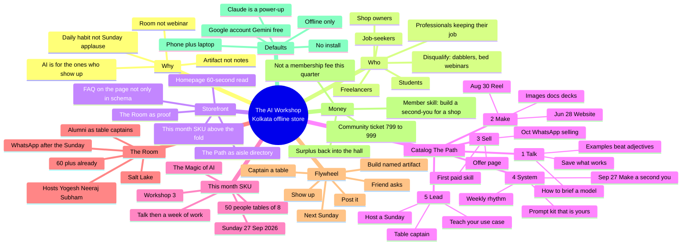
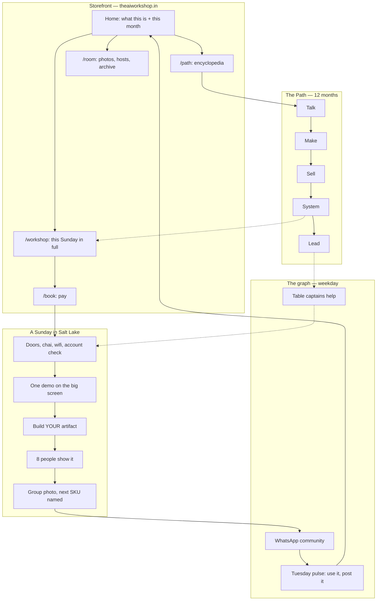
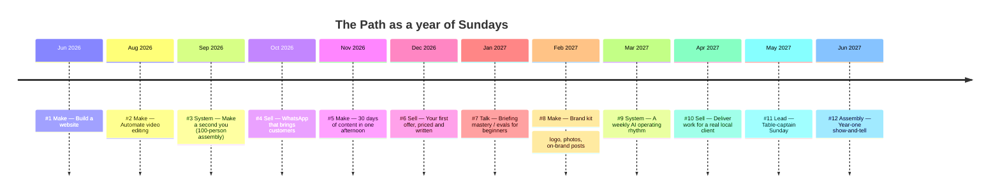
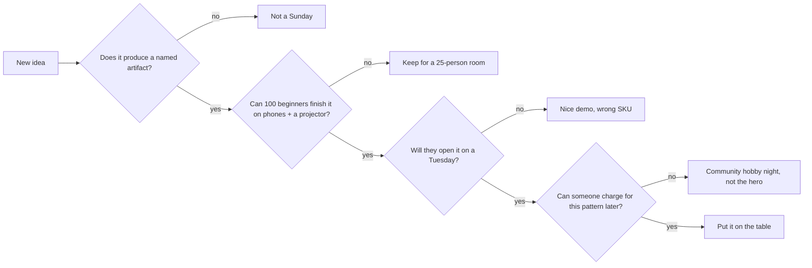

# Mind map

The whole organism. If a page, a workshop, or a WhatsApp message cannot be placed on this map, it does not belong yet.

---

## One-glance map



---

## System map (how the pieces talk)



---

## The store, drawn as a floor

```
┌─────────────────────────────────────────────────────────────┐
│  WINDOW (hero)                                              │
│  The AI Workshop · Kolkata                                  │
│  “AI is for the ones who show up.”                          │
│  THIS SUNDAY: Make a second you · 27 Sept · ₹799 · 100 seats│
│  [ Reserve your seat ]        [ See the Path ]              │
├──────────────┬──────────────────────────────┬───────────────┤
│ AISLE GUIDE  │  SHOWROOM TABLE              │  THE ROOM     │
│              │                              │               │
│ 1 Talk       │  Workshop #3 kit             │  Meetup #1    │
│ 2 Make       │  - 8 questions               │  websites     │
│ 3 Sell       │  - Gem recipe                │  Meetup #2    │
│ 4 System ◄── │  - “sell this to a shop”     │  reels        │
│ 5 Lead       │    one-pager                 │  Hosts named  │
│              │                              │  Captains     │
├──────────────┴──────────────────────────────┴───────────────┤
│  COUNTER: /book · Razorpay or pay at venue · WhatsApp after │
│  STAFF DOOR: become a table captain (alumni only)           │
└─────────────────────────────────────────────────────────────┘
```

---

## Year map (the catalog on the wall)



Sundays can slide. The **chapter** cannot. If we skip System and jump to more Make, people collect artifacts they do not use. If we skip Sell, the “monetize” promise is a poster. If we skip Lead, the hosts become the bottleneck and the store dies at 60 members.

---

## Decision map (when we say no)


